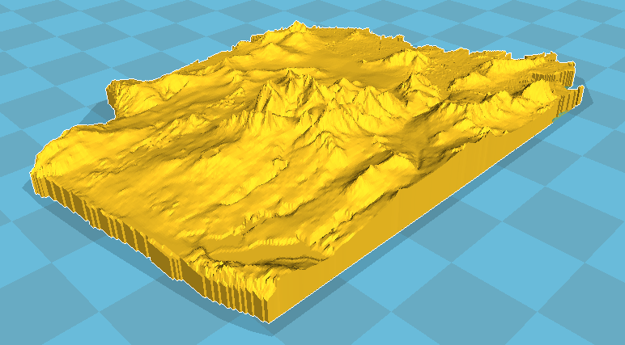
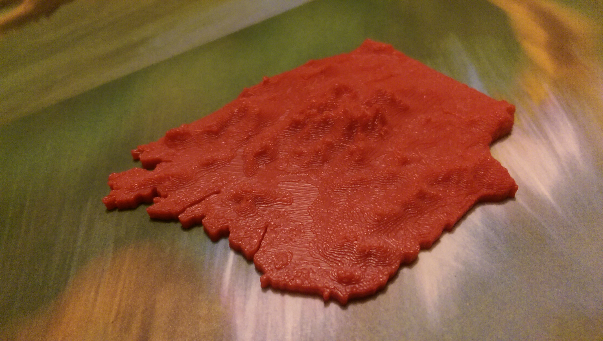

3D model of San Francisco
=========================

## Requirements

You'll need a couple of software packages installed in order to run this
pipeline: [GDAL](http://www.gdal.org/) (for manipulating the geodata), Cura
(recommended for rendering GCode), and Blender, for tweaking the 3D model,
e.g. to turn it from a surface into a solid.

Also `unzip` and `wget`.

## Usage

To generate a topographical model of San Francisco, run at the command line:

```
git clone http://github.com/justinmanley/topoSF
cd topoSF
make
```

You will have to complete the last two steps manually - there are instructions
in the Makefile.

Here's what you'll get once you've finished those last two steps:



When it's printed, the model will be about 2 1/2 by 3 1/2 inches. If you want 
it to be bigger or smaller, just change the parameters passed to phstl on the
command line. Here's what the final print looks like:

 

Have fun!
